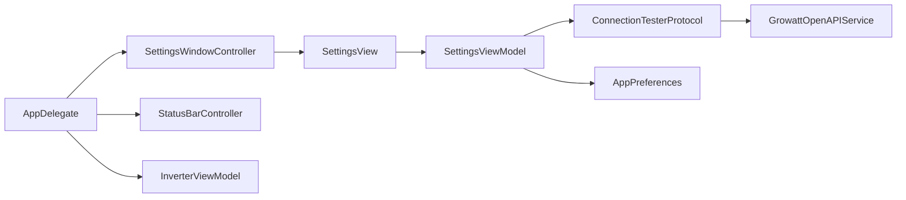

# Implementation Plan

## Architecture

Core remains AppKit-free. The AppKit target owns window presentation and lifecycle; Core owns settings state, validation, connection testing, and SwiftUI composition.



## Connection test seam

Add `GrowattConnectionTesterProtocol`, accepting draft API key and URL and returning `InverterStatus` asynchronously. Add `GrowattConnectionTester`, which validates and constructs a temporary `GrowattOpenAPIService` and performs `/status` without persistence.

This preserves dependency inversion, keeps SwiftUI independent of transport construction, and permits deterministic tests with a mock tester.

## Settings state

Add `SettingsViewModel` using `@Observable @MainActor`. It owns draft values, local validation, tested-value validity, operation state, safe error mapping, and save/test orchestration. The tested state must be tied to the exact current normalized values. The API key may be compared in memory but must never be logged or included in accessibility text.

## View composition

Split the current monolithic view into:

- `SettingsView`: mode-aware `NavigationSplitView` shell.
- `SettingsSidebarView`: sidebar navigation.
- `OnboardingContentView`: welcome, value proposition, progress, and CTA.
- `ConnectionFormView`: URL/key fields, validation, Test Connection, and Save/Update.
- `ConnectionStatusView`: loading, success, and safe error feedback.
- `SettingsMode`: onboarding/settings mode value type.

Each significant type gets its own file.

## Window lifecycle

`SettingsWindowController` remains in the AppKit target. It accepts an explicit mode, creates the Core view/model, presents a fixed native settings window, retains normal titlebar behavior, and handles close confirmation according to mode.

`AppDelegate` determines mode from onboarding state and coordinates preferences, the settings window, runtime service construction, and status-bar controller replacement. Failed persistence must not mark onboarding complete or reconfigure runtime state.

## Data flow

```text
Draft fields
  -> local validation
  -> temporary connection tester
  -> successful test tied to exact current values
  -> explicit Save/Update
  -> Keychain + UserDefaults persistence
  -> runtime service reconfiguration
```

## Persistence boundaries

- Test Connection never writes Keychain, UserDefaults, or onboarding state.
- Save writes the API key to Keychain and API URL to UserDefaults.
- Onboarding completion is written only after persistence and runtime setup succeed.
- Persistence failure preserves the draft and leaves runtime configuration unchanged.

## Error mapping

Use safe user-facing messages:

| Error | User-facing message |
|---|---|
| `unauthorized` | The API key was rejected. Check the key and try again. |
| `networkError` | The API could not be reached. Check the URL and network connection. |
| `decodingError` | The endpoint returned an unexpected response. |
| `serverError` | The API server is unavailable right now. Try again later. |
| `keychainError` | The credentials could not be saved securely. Try again. |

Underlying details must not appear in UI, accessibility announcements, or logs.

## File-level changes

### New files

- `src/GrowattToolbarCore/Models/SettingsMode.swift` — onboarding/settings mode.
- `src/GrowattToolbarCore/Services/GrowattConnectionTesterProtocol.swift` — injectable test seam.
- `src/GrowattToolbarCore/Services/GrowattConnectionTester.swift` — temporary-service tester.
- `src/GrowattToolbarCore/ViewModels/SettingsViewModel.swift` — settings state and lifecycle.
- `src/GrowattToolbarCore/Views/SettingsSidebarView.swift` — sidebar navigation.
- `src/GrowattToolbarCore/Views/OnboardingContentView.swift` — first-launch experience.
- `src/GrowattToolbarCore/Views/ConnectionFormView.swift` — connection form.
- `src/GrowattToolbarCore/Views/ConnectionStatusView.swift` — status feedback.
- `Tests/GrowattToolbarCoreTests/SettingsViewModelTests.swift` — state-machine tests.
- `Tests/GrowattToolbarCoreTests/GrowattConnectionTesterTests.swift` — tester tests.
- `Tests/GrowattToolbarCoreTests/TestDoubles/MockConnectionTester.swift` — deterministic test double.

### Modified files

- `src/GrowattToolbarCore/Views/SettingsView.swift` — replace fixed form with shell/composition.
- `src/GrowattToolbarApp/SettingsWindowController.swift` — mode-aware native window lifecycle.
- `src/GrowattToolbarApp/GrowattToolbarApp.swift` — onboarding/settings wiring and save lifecycle.
- `src/GrowattToolbarCore/Services/AppPreferences.swift` — safe persistence behavior.
- `src/GrowattToolbarCore/Services/GrowattOpenAPIService.swift` — safe throwing initialization and URL handling.
- `src/GrowattToolbarCore/Services/GrowattAPIError.swift` — safe UI mapping support.
- `Package.swift` — test target registration if absent.
- `PRODUCT.md` — remove obsolete no-settings-window constraint.
- `CHANGELOG.md` — implementation changelog entry.

`GlassTokens.swift` remains unchanged unless settings-specific tokens are necessary.

## Testing strategy

- Unit-test local validation.
- Unit-test tested-value invalidation.
- Unit-test loading and duplicate-operation prevention.
- Unit-test typed-error-to-message mapping.
- Unit-test test-before-save persistence boundaries.
- Unit-test persistence failure behavior.
- Unit-test onboarding completion behavior.
- Use injected transport or URLProtocol for service tests.
- Manually verify keyboard traversal, VoiceOver, Dynamic Type, light/dark appearance, Increase Contrast, Reduce Transparency, Reduce Motion, macOS 15 fallback, and macOS 26 behavior.
